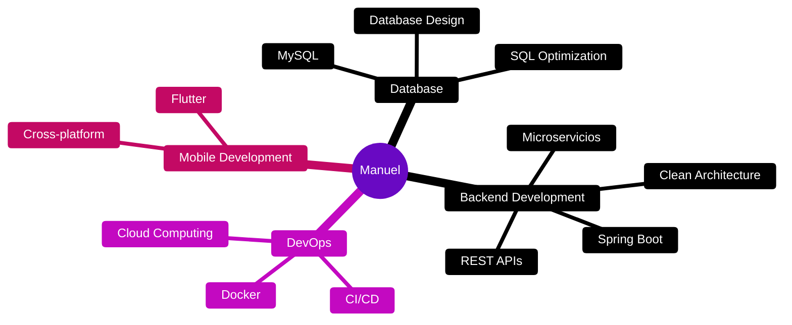

<div align="center">


# 👨‍💻 MANUEL DOMÍNGUEZ

<a href="https://git.io/typing-svg"></a>

<br>

[](https://www.linkedin.com/in/manueljesdominguez)
[](mailto:mandomdie@gmail.com)
[](https://github.com/manudomdd)

</div>

<br>

<div align="center">

```javascript
const Manuel = {
    ubicación: "Sevilla, España 🇪🇸",
    educación: "DAM 2º Año - IES Camas 🎓",
    rol: "Desarrollador Back End",
    stackFavorito: ["Java", "Spring Boot", "MySQL"],
    misión: "Innovar y resolver problemas con código 💡"
};
```

</div>

<br>

<div align="center">

## 💻 STACK TECNOLÓGICO & HERRAMIENTAS

<br>


<br><br>

### 🎯 ÁREAS DE ENFOQUE

<table align="center">
<tr>
<td align="center" width="25%">

<br><strong>Java</strong>
<br><sub>Backend Core</sub>
</td>
<td align="center" width="25%">

<br><strong>Spring Boot</strong>
<br><sub>Framework Principal</sub>
</td>
<td align="center" width="25%">

<br><strong>MySQL</strong>
<br><sub>Bases de Datos</sub>
</td>
<td align="center" width="25%">

<br><strong>Docker</strong>
<br><sub>DevOps</sub>
</td>
</tr>
</table>

<br>


</div>

<br>

<div align="center">

## 📊 ESTADÍSTICAS DE GITHUB

<br>


<br><br>


<br><br>


</div>

<br>

<div align="center">

## 🌱 ACTUALMENTE APRENDIENDO

<br>

<table align="center">
<tr>
<td align="center" width="33%">

<br><br>
<strong>🔧 Microservicios</strong>
<br><sub>Arquitectura distribuida</sub>
<br>

</td>
<td align="center" width="33%">

<br><br>
<strong>🚀 DevOps</strong>
<br><sub>CI/CD & Automatización</sub>
<br>

</td>
<td align="center" width="33%">

<br><br>
<strong>☁️ Cloud Computing</strong>
<br><sub>AWS & Azure</sub>
<br>

</td>
</tr>
</table>

</div>

<br>

<div align="center">

## 🎯 ÁREAS DE INTERÉS

<br>



</div>

<br>

---

<br>

<div align="center">

## 📫 CONECTA CONMIGO

<br>

```javascript
const oportunidades = {
    colaborar: "Abierto a proyectos innovadores 🤝",
    charla: "Siempre disponible para hablar de tech 💬",
    objetivo: "Crear soluciones que impacten 🎯"
};
```

<br><br>

<a href="mailto:mandomdie@gmail.com">
  
</a>
<br>
<a href="https://www.linkedin.com/in/manueljesdominguez">
  
</a>
<br>
<a href="https://github.com/manudomdd">
  
</a>

<br><br>

### 💜 Gracias por visitar mi perfil

<br>


</div>

<br>


</div>
